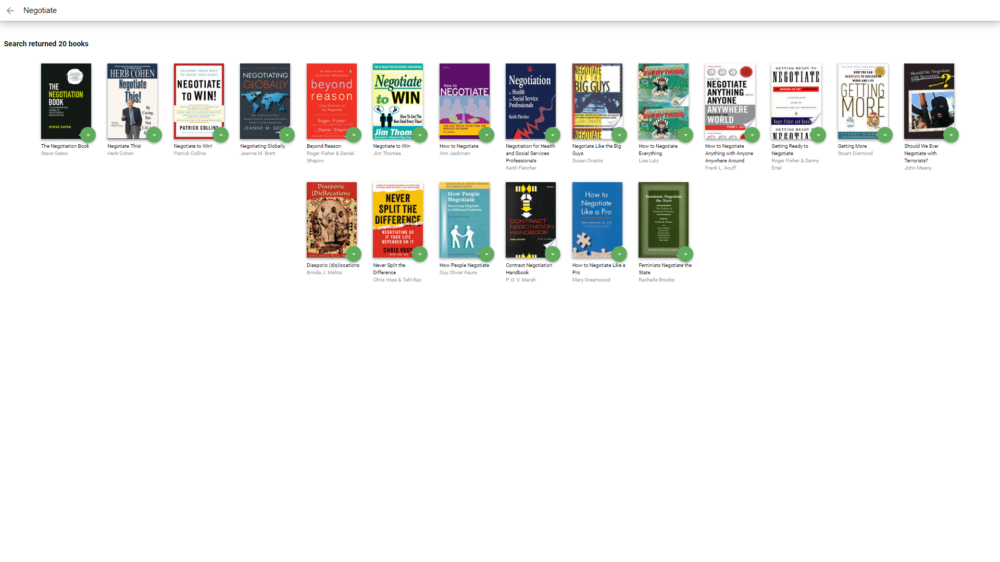

# MyReads Project

This project was proposed by Udacity React Nanodegree to implement the basic knowledge of react acquired during the learning program.
My Reads consists of creating a book shelf that the user is currently reading, wants to read and read, and a book search screen to include on the shelf


## To install project dependencies
```
$ npm install ou yarn install
```

## Execute application
```
$ npm start ou yarn start
```

# Screenshots

## Home


## Search

